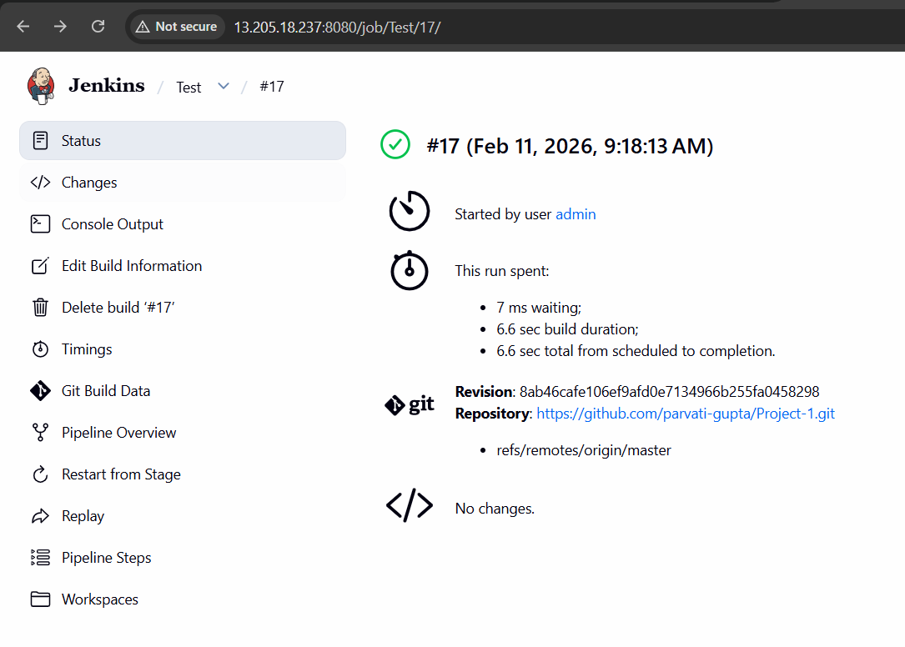
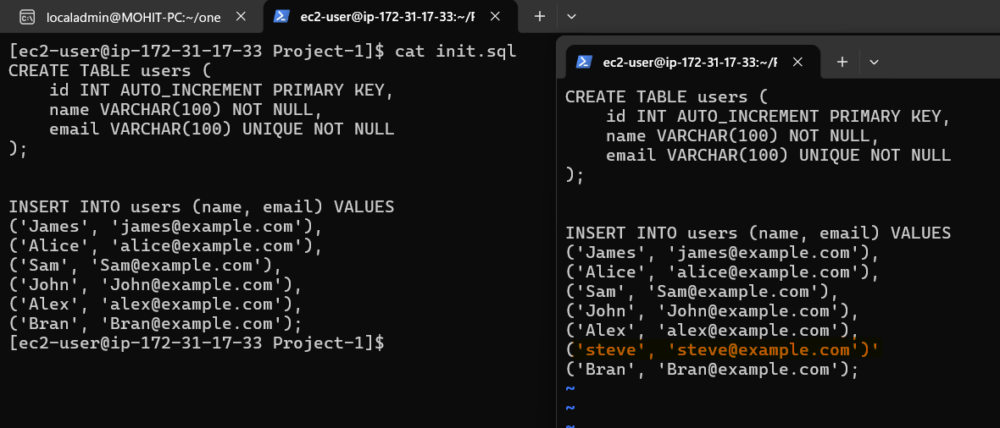
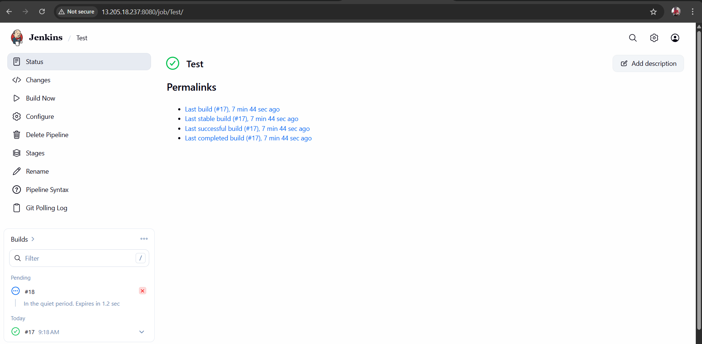
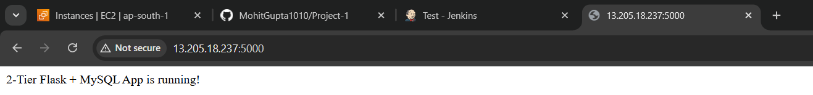
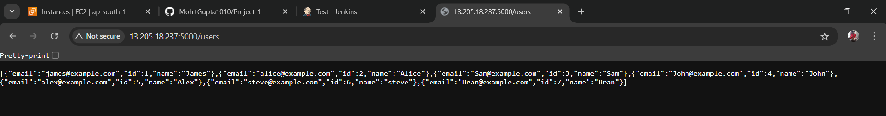

## Create a EC2-instance on AWS and install below packages.
```
sudo yum install git python3 java wget -y
```
##
Add the port 5000,8080 in the security group of EC-instance inbound rule.

Install the jenkins [from here](https://www.jenkins.io/doc/book/installing/linux/)

Install docker and its related rpm [from here](https://docs.docker.com/engine/install/rhel/)

##
1. Add the docker Id and password in jenkins credentials of Kind username with password and bind them seperately by using withCredentials having USER as variable name for username and PASS as a variable name for password
2. Create a pipeline and add the git scm polling add the time interval as * *  * * *
3. Also add the jenkins to docker group
```
sudo usermod -aG docker jenkins
sudo systemctl restart jenkins.service
```

##
## Clone the repository and push it to your repo.
### Edit the Repo URL in the Jenkinsfile too it should match your repository.
```
git clone "https://github.com/MohitGupta1010/Project-1.git"
rm -rf .git/
git remote add origin "<your-repo-https-url>" 
git add .
git commit -m "First commit"
git push origin
```
##



##

After adding one more line in init.sql to trigger the poll scm, commit and push the change to github.





## Output



-------------------------------
-------------------------------


